# NVIDIA Structural Break & Semiconductor Sector Dynamics


> Independent research project — applied financial econometrics using structural break detection, VAR, Granger causality, IRF, and DCC-GJR-GARCH on 25 years of semiconductor sector data.

---

## Research Question

Did NVIDIA's 2015 structural break alter not only its return level, but also its **role within the system of interdependencies** in the semiconductor sector?

---

## Key Findings

| Finding | Before 2015 | After 2015 |
|---|---|---|
| Granger causality NVDA → SOXX | ✅ significant (p = 0.026) | ❌ disappeared (p = 0.219) |
| Granger causality SOXX → NVDA | ❌ absent | ✅ emerged (p = 0.010) |
| NVDA momentum (own lag) | ❌ absent | ✅ significant |
| NVDA mean return drift | near zero | positive & significant |
| DCC reaction speed (dcca1) | 0.013 | 0.034 |
| DCC persistence (dccb1) | 0.972 | 0.908 |
| NVDA–AMD correlation | ~0.50 | ~0.60 ↑ |
| NVDA–INTC correlation | ~0.50 | ~0.40 ↓ |
| NVDA shock → INTC variance share | 15.9% | 1.4% ↓ |
| Sector shock → SOXX variance share | 56.7% | 67.5% ↑ |

**Summary:** NVIDIA transitioned from a niche sector leader whose lagged returns predicted the broad index. The 2015 break coincides with NVIDIA's reclassification from a niche GPU manufacturer to a core AI infrastructure holding, consistent with the category-based comovement channel of Barberis et al. (2005). The sector split into two camps — NVDA/AMD converged as AI companies, while INTC diverged.

---

## Repository Structure

```
├── R/
│   ├── structural_break/
│   │   ├── sb_nvda.R       # Bai-Perron & CUSUM for NVDA
│   │   ├── sb_amd.R        # Structural break analysis for AMD
│   │   ├── sb_intc.R       # Structural break analysis for INTC
│   │   └── sb_soxx.R       # Structural break analysis for SOXX
│   └── analysis/
│       └── var_dcc.R       # VAR, Granger, IRF, DCC-GARCH, rolling correlation
├── images/                 # Plots referenced in this README
└── report/
    └── report.Rmd          # Full report (Rmd)
```

---

## Data

| Parameter | Value |
|---|---|
| Source | Yahoo Finance via `quantmod` |
| Frequency | Weekly log-returns |
| Period | 2001 – present |
| Assets | NVDA, AMD, INTC, SOXX ETF |
| Breakpoint | July 2015 |
| Pre-break obs. | 733 |
| Post-break obs. | 555 |

---

## Methodology

### Stage 1 — Structural Break Detection

Applied to GARCH-adjusted returns (AR(1) + GJR-GARCH(1,1) with skewed-t innovations) to remove volatility clustering before testing for mean shifts.

| Test | Result |
|---|---|
| Ave-F / Exp-F | Significant |
| OLS-CUSUM | Significant break in 2015 |
| Recursive Estimates | Significant break in 2015 |
| Partial structural break | Significant break in 2015 |
| Bai-Perron |Insignificant, indicates to 2015 |

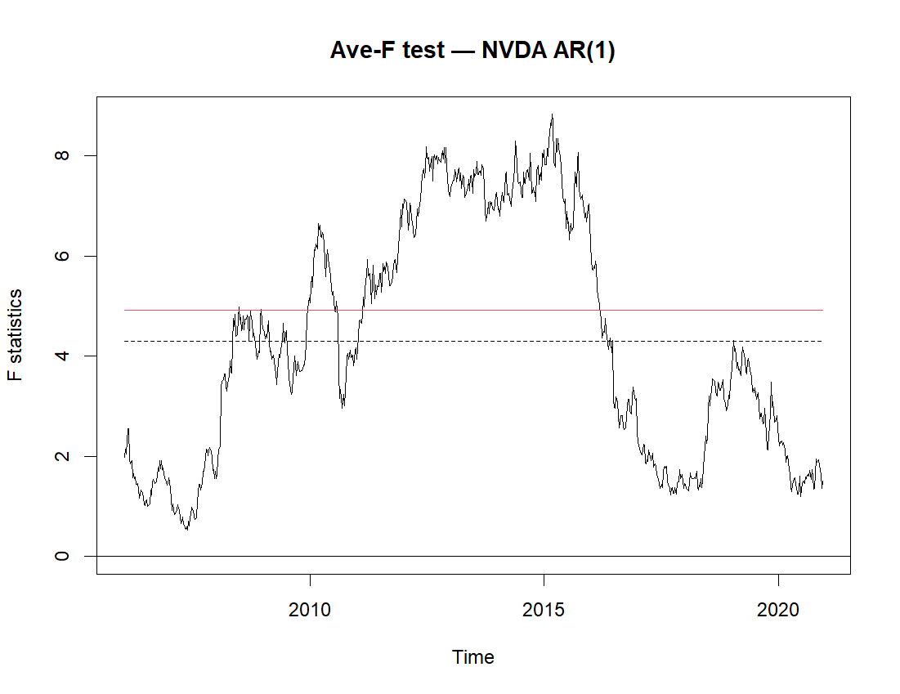
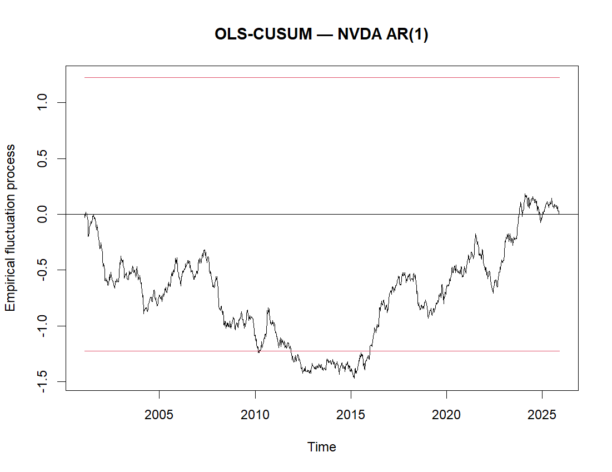
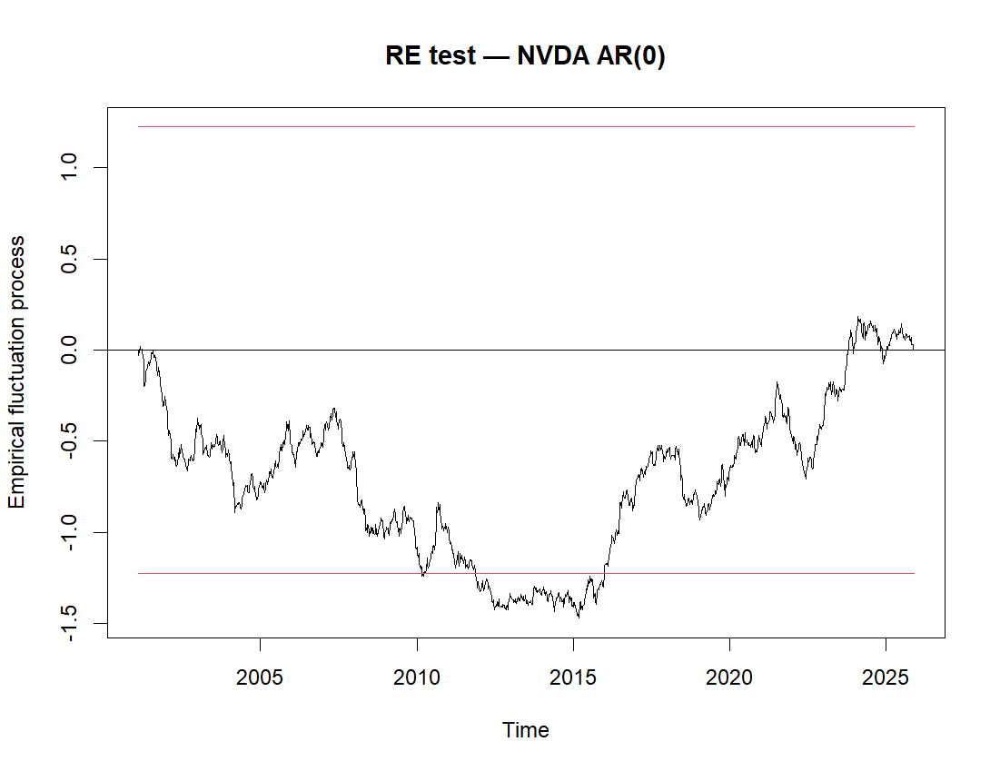
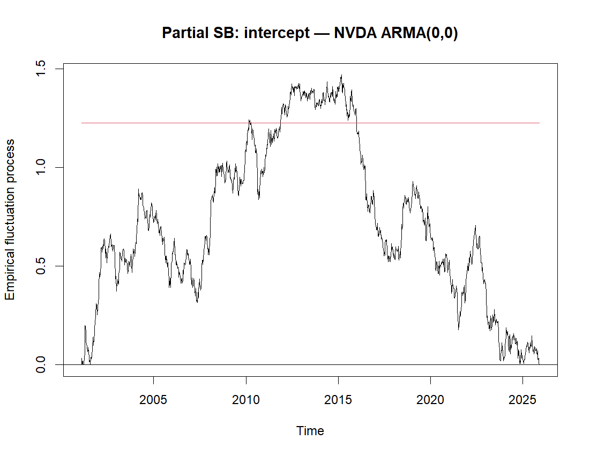

---

### Stage 2 — Forecasting Impact

Comparing GARCH models estimated on the full sample vs. the post-break subsample shows materially different return and volatility forecasts — ignoring the break leads to systematic underestimation of post-2015 drift and volatility persistence.

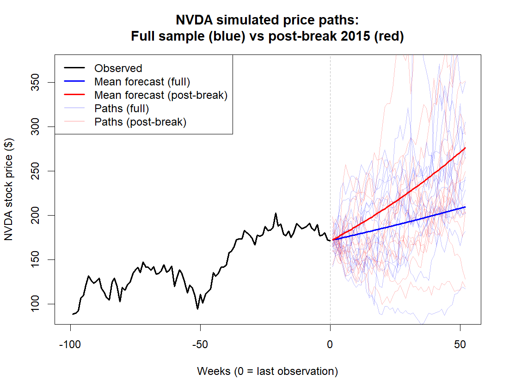
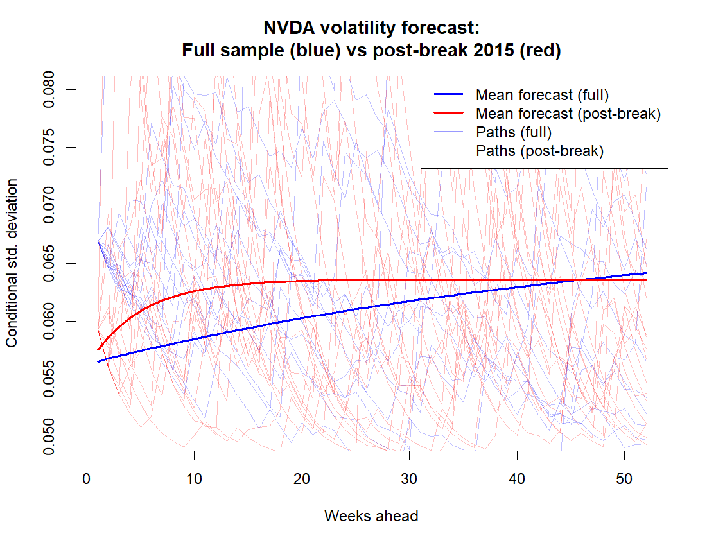

---

### Stage 3 — VAR Model

VAR(1) selected unanimously by AIC, HQ, SC, FPE for both sub-periods. Consistent with weak-form market efficiency at weekly frequency.

Residual diagnostics (Hosking, Li-McLeod) confirm white noise residuals. CUSUM stability confirms the 2015 split is methodologically justified.

**Pre-2015:** Only one significant coefficient in the entire VAR matrix — NVDA.l1 in the SOXX equation (β = 0.064, p = 0.029). NVDA led the sector through lags.

**Post-2015:** NVDA acquires a significant own lag (β = 0.158, p = 0.020) and positive drift (β = 0.010, p = 0.0002). The lagged leadership disappears.

---
## Stage 4 — Sign-Restricted SVAR & FEVD

To address the ordering dependence inherent in Cholesky-based identification, a sign-restricted SVAR was estimated following the Rubio-Ramírez (2010) rotation algorithm. Rather than imposing a recursive causal ordering, the identification rests on theoretically motivated sign restrictions on the impact matrix.

### Identification

The restrictions encode the following economic narrative:

| Response | NVDA shock | AMD shock | INTC shock | Sector shock |
|----------|-----------|-----------|------------|--------------|
| NVDA | + | — | — | + |
| AMD | + | + | — | + |
| INTC | — | — | + | + |
| SOXX | — | — | — | + |

**NVDA shock** is identified as an idiosyncratic AI-driven shock: it must raise both NVDA and AMD (as co-beneficiaries of the AI narrative), while its effect on INTC and SOXX is left unrestricted. **Sector shock** is identified as a broad semiconductor shock that raises all four assets simultaneously. The remaining shocks are identified only by their own-variable sign.

Out of 10,000 random orthogonal rotations, 2,940 (29.4%) satisfied the restrictions in the pre-2015 period, indicating strong compatibility between the restrictions and the data. IRFs are reported as posterior means with 68% credible bands across accepted rotations.

### Structural Impulse Response Functions


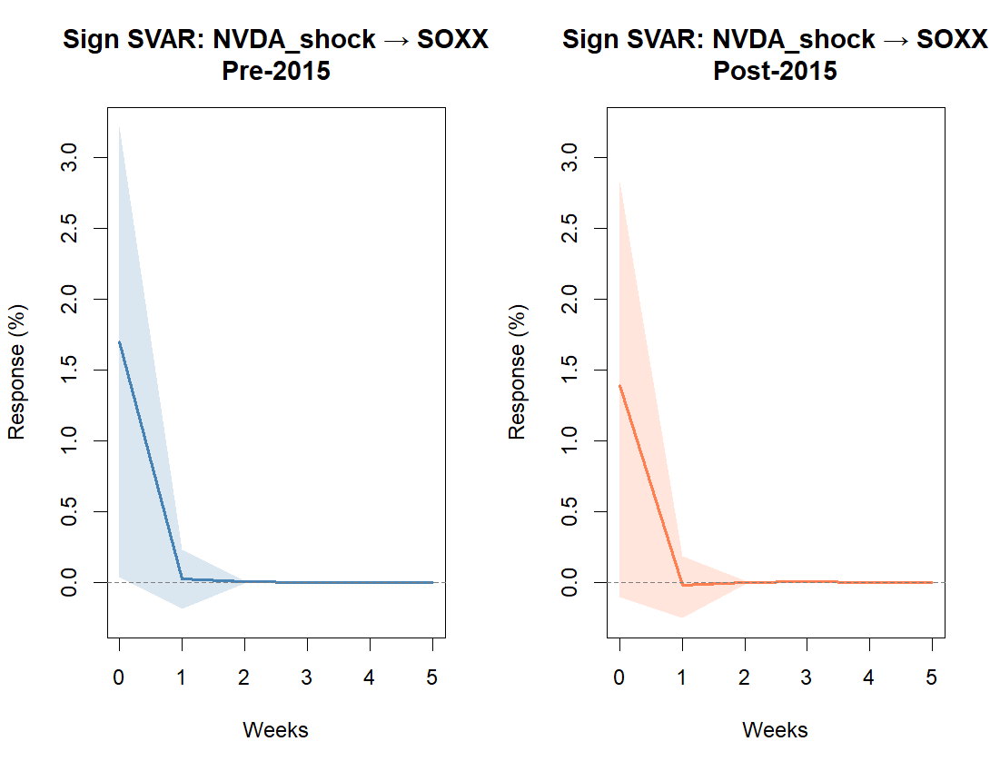
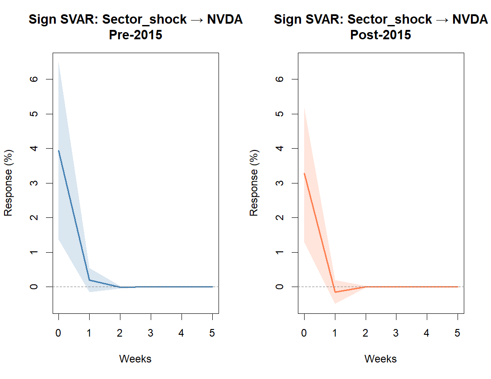
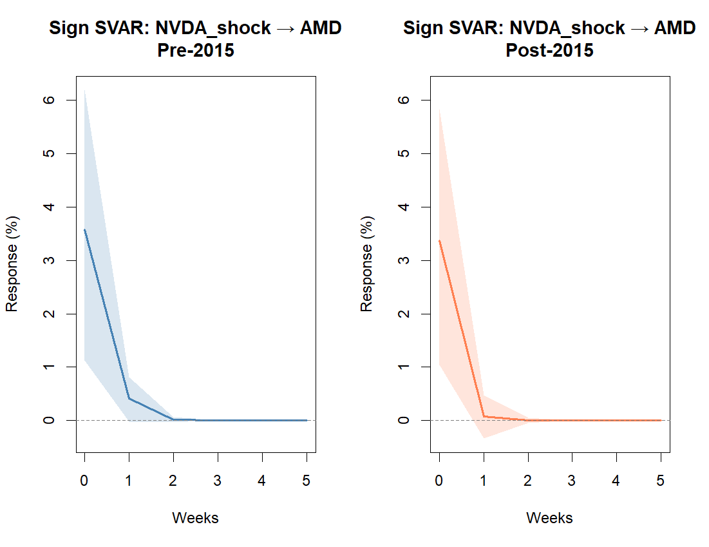
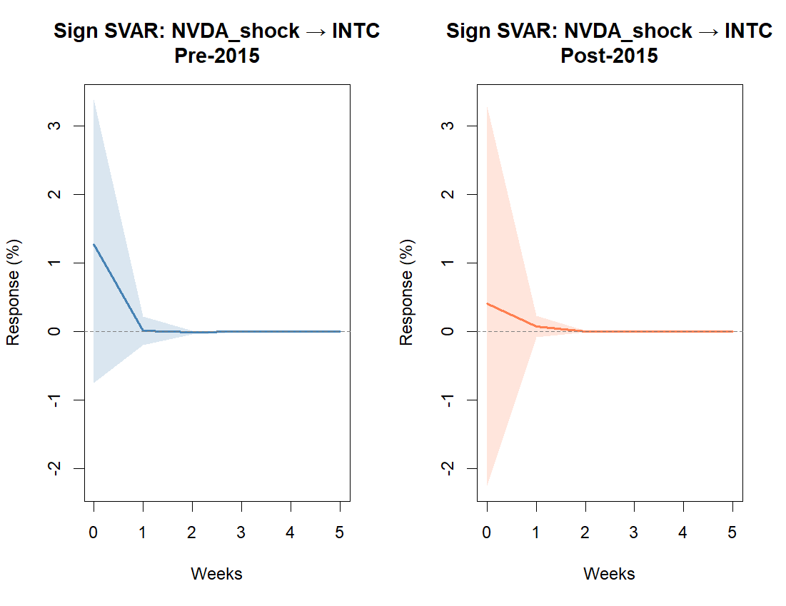
The structural IRFs confirm the reduced-form findings. The response of SOXX to an NVDA shock at impact is positive in both periods (~1.6% pre-2015, ~1.4% post-2015), but the post-2015 credible band widens considerably, reflecting greater uncertainty around NVDA's sectoral transmission. The response of NVDA to a Sector shock remains stable across periods, consistent with NVDA's deeper integration into the broad semiconductor index post-2015 — a finding corroborated by the DCC results.

### Forecast Error Variance Decomposition

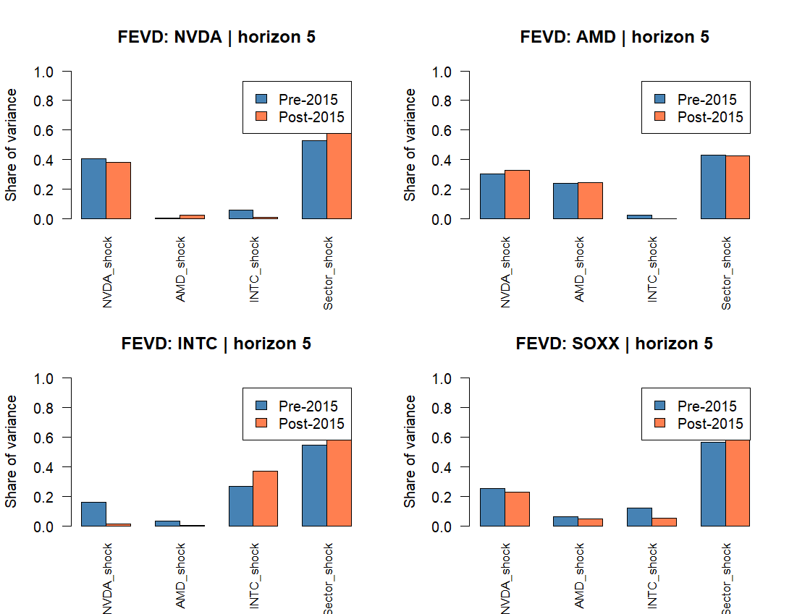

Given the fast mean reversion of the estimated VAR(1) — coefficients in the range of 0.06–0.18 — the IRF decays to near-zero within one week. As a result, the FEVD is effectively determined by the impact period and remains constant across horizons. The decomposition therefore captures the contemporaneous shock structure rather than dynamic propagation.

| Variable | Source | Pre-2015 | Post-2015 | Δ |
|----------|--------|----------|-----------|---|
| NVDA | NVDA shock | 0.406 | 0.382 | −0.024 |
| NVDA | Sector shock | 0.529 | 0.585 | +0.056 |
| AMD | NVDA shock | 0.301 | 0.327 | +0.026 |
| AMD | Sector shock | 0.432 | 0.427 | −0.005 |
| INTC | NVDA shock | 0.159 | 0.014 | **−0.145** |
| INTC | Sector shock | 0.544 | 0.616 | +0.072 |
| SOXX | NVDA shock | 0.253 | 0.229 | −0.024 |
| SOXX | Sector shock | 0.567 | 0.675 | +0.108 |

**NVDA:** The idiosyncratic NVDA shock accounts for a slightly smaller share of its own variance post-2015 (38.2% vs 40.6%), while the Sector shock contribution rises from 52.9% to 58.5%. This is consistent with NVDA transitioning from a niche leader to a deeply sector-integrated asset subject to institutional rotation dynamics, as identified in the VAR and DCC stages.

**AMD:** The share of variance explained by NVDA shock in AMD increases marginally post-2015 (30.1% → 32.7%), while AMD's own shock contribution remains stable (~24%). This supports the convergence narrative: AMD and NVDA became more tightly linked as AI companies, moving in response to the same idiosyncratic shock.

**INTC:** The most pronounced structural shift in the entire decomposition. The contribution of NVDA shock to INTC variance collapses from 15.9% pre-2015 to 1.4% post-2015 — a reduction of 14.5 percentage points. Simultaneously, INTC's own shock contribution rises (26.6% → 36.9%) and the Sector shock share increases (54.4% → 61.6%). Post-2015, INTC variance is driven either by its own idiosyncratic dynamics or by the broad sector — but no longer by NVDA. Importantly, since no sign restriction was placed on INTC's response to NVDA shock (the cell is unrestricted), this result is not an artefact of identification: the data itself selected a near-zero response.

**SOXX:** The Sector shock accounts for a growing share of the index's own variance (56.7% → 67.5%), while the NVDA shock contribution declines modestly (25.3% → 22.9%). The index became more driven by the common semiconductor factor and less by any single constituent's idiosyncratic shock — a sign of broader sector coordination post-2015.

### Methodological note

Since sign restrictions are imposed only at the impact horizon and the IRF decays within one period, the FEVD should be interpreted as a decomposition of contemporaneous variance rather than a long-horizon forecast error decomposition. For this reason, results across horizons 1–5 are numerically identical and only the impact-period decomposition is reported.

---

### Stage 5 — Granger Causality

**System-level tests:**

| Variable | Pre-2015 (p) | Post-2015 (p) |
|---|---|---|
| NVDA → others | **0.037** ✅ | 0.411 ❌ |
| AMD → others | 0.580 | 0.921 |
| INTC → others | 0.161 | 0.509 |
| SOXX → others | 0.302 | 0.306 |

**Pairwise tests (key directions):**

| Direction | Pre-2015 (p) | Post-2015 (p) |
|---|---|---|
| NVDA → SOXX | **0.026** | 0.219 |
| SOXX → NVDA | 0.953 | **0.010** |
| NVDA → AMD | 0.103 | 0.070 |

The reversal of SOXX → NVDA causality is interpreted as **institutional rotation**: large funds hold NVDA as a semiconductor bet and rebalance relative to the ETF benchmark.

---

### Stage 6 — Impulse Response Functions

**NVDA → SOXX:** Significant positive response at week 1 before 2015 (~0.065, CI excludes zero). After 2015: response shrinks (~0.047) and becomes statistically insignificant.

**SOXX → NVDA:** No significant response before 2015. After 2015: persistently negative direction (~−0.2), consistent with Granger p = 0.010, interpreted as rotation effect.

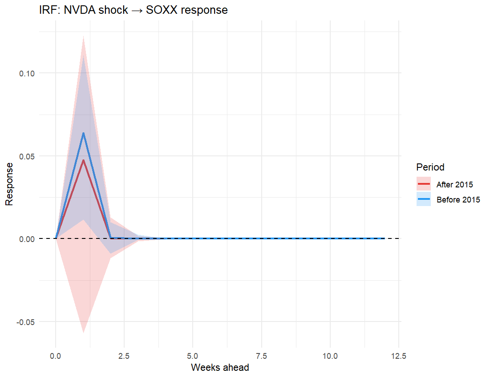
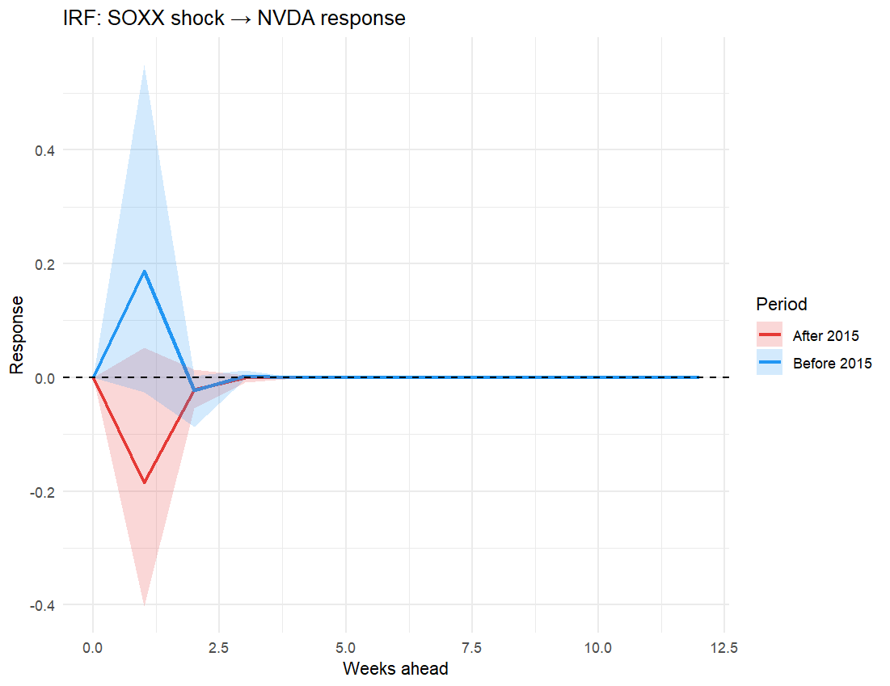

---

### Stage 7 — DCC-GJR-GARCH

Univariate GJR-GARCH models (skewed-t innovations) estimated per asset, then combined in a DCC(1,1) structure. Estimated separately for each sub-period.

**NVDA post-2015:** beta1 = 0.996 — volatility process approaches a near-random walk. Large AI-driven moves dissipate very slowly.

**Dynamic correlation changes:**

| Pair | Pre-2015 | Post-2015 | Interpretation |
|---|---|---|---|
| NVDA–AMD | ~0.50 | ~0.60 ↑ | Converged as AI companies |
| NVDA–INTC | ~0.50 | ~0.40 ↓ | Diverged sharply |
| NVDA–SOXX | ~0.70 | ~0.75 ↑ | Deeper sector integration |
| AMD–INTC | ~0.50 | ~0.30 ↓ | AMD moved to AI/gaming |

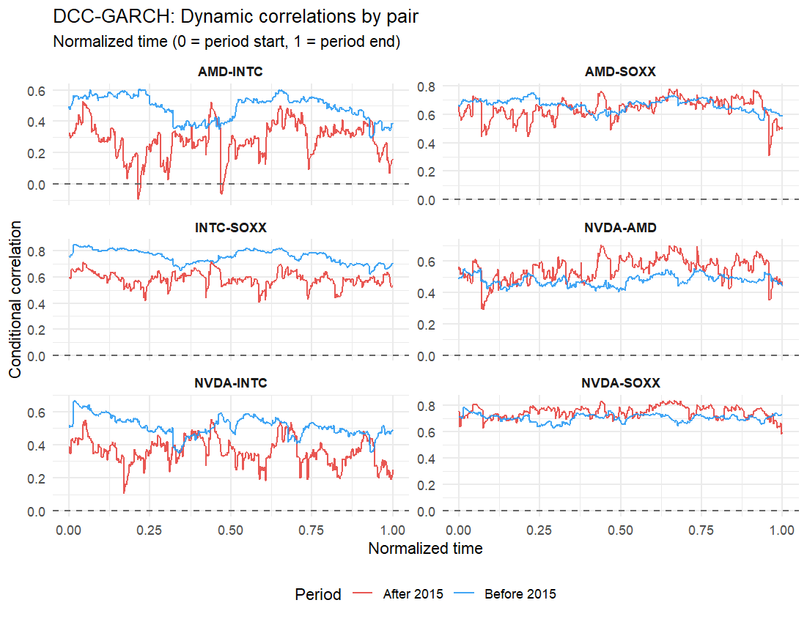
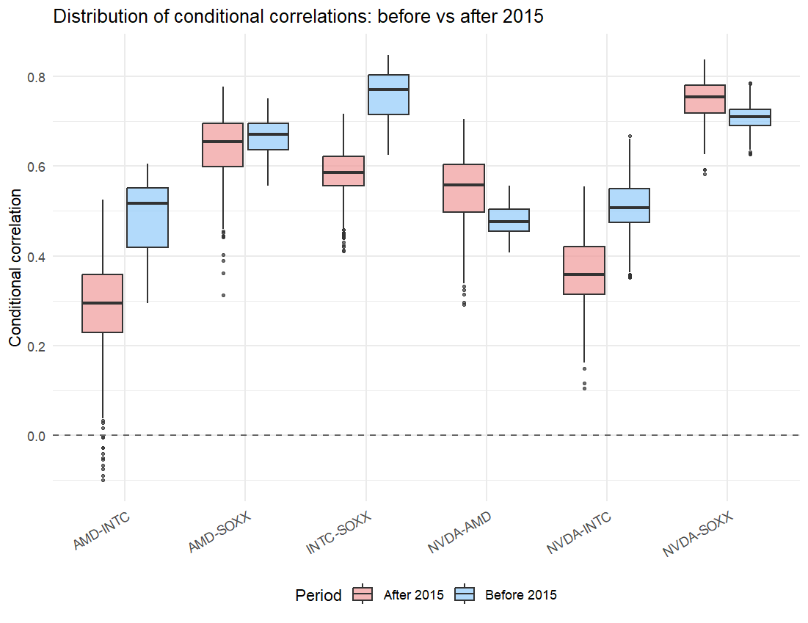

---

### Stage 8 — Rolling Correlation (Robustness Check)

52-week rolling window provides a non-parametric benchmark confirming DCC results. Post-2015 divergence of NVDA–INTC and relative stability of NVDA–AMD are clearly visible.

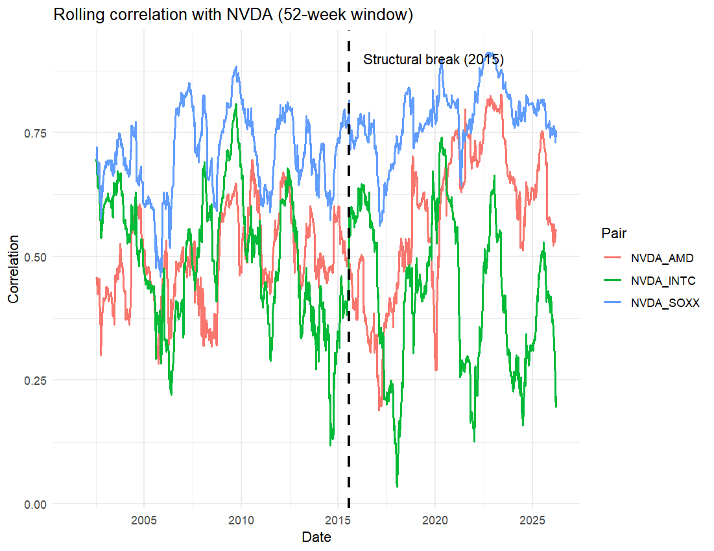

---

## Reproducibility

Data is downloaded automatically via `quantmod`. No local files required.

```r
install.packages(c(
  "quantmod", "TSA", "forecast", "urca", "tseries",
  "lmtest", "rugarch", "fGarch", "strucchange",
  "strucchangeRcpp", "vars", "rmgarch",
  "ggplot2", "dplyr", "tidyr", "zoo", "FinTS", "portes"
))
```

**Run order:**

```r
# Stage 1: Structural break analysis
source("R/structural_break/sb_nvda.R")

# Stage 2: Multivariate analysis
source("R/analysis/var_dcc.R")
```

## Limitations

- The breakpoint (July 2015) is treated as fixed based on test consensus
- Weekly frequency may smooth intra-week dynamics
- GARCH orders selected via standard diagnostics; exhaustive grid search not conducted
- DCC assumes a constant unconditional correlation matrix within each sub-period


## License

MIT — see [LICENSE](LICENSE) for details.
