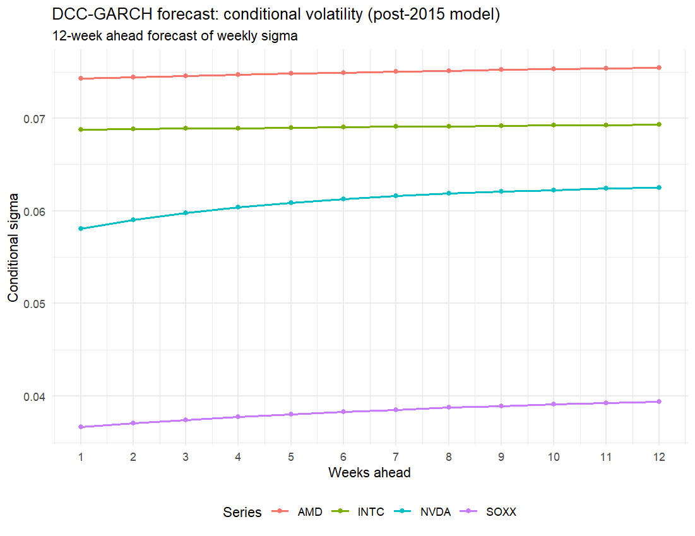

# NVIDIA Structural Break and Dynamic Correlation Analysis (DCC-GARCH)

## Overview

This project investigates how the role of NVIDIA (NVDA) within the semiconductor sector changed after a structural break identified in 2015.

The analysis proceeds in two stages:

1. Detecting and validating a structural break in NVIDIA returns
2. Examining how interdependencies within the semiconductor sector evolved before and after the break using multivariate time series models

The key result is that **dynamic correlations between NVIDIA and the rest of the sector exhibit statistically significant changes**, indicating that **NVIDIA became less dependent on sector-wide dynamics after 2015**.

---

## Project Structure

The project consists of two main scripts:

* `sb_nvda.R` — Structural break detection and univariate modeling (NVDA)
* `var_dcc.R` — Multivariate analysis of sector dynamics (VAR, DCC-GARCH)

---

## Data

* Source: Yahoo Finance (via `quantmod`)
* Frequency: Weekly
* Period: 2001–present
* Assets:

  * NVIDIA (NVDA)
  * AMD (AMD)
  * Intel (INTC)
  * iShares Semiconductor ETF (SOXX)

Log-returns are computed for all series.

---

## Methodology

### 1. Structural Break Detection (NVDA)

The first stage focuses on identifying instability in NVIDIA return dynamics.

Methods used:

* Sup-F, Ave-F, Exp-F tests (Andrews, Andrews-Ploberger)
* CUSUM and MOSUM tests
* Recursive and moving estimates (RE, ME)

Volatility clustering is accounted for using a **GJR-GARCH(1,1)** model, and structural break tests are applied to volatility-adjusted returns.

**Result:**
A structural break is identified around **July 2015**.


---

### 2. Impact on Forecasting (Univariate GARCH)

To assess the practical relevance of the break:

* GARCH models are estimated:

  * on the full sample
  * on the post-break subsample

Comparison includes:

* Mean forecasts
* Volatility forecasts
* Simulated price paths

**Insight:**
Ignoring the structural break leads to materially different forecasts.


---

### 3. Multivariate Dynamics (Pre vs Post Break)

The second stage evaluates how relationships within the semiconductor sector change across regimes.

#### VAR Model

* VAR(1) selected via information criteria
* Estimated separately for:

  * pre-2015 period
  * post-2015 period

Diagnostics confirm model adequacy within each regime.

---

#### Granger Causality

Both system-wide and pairwise tests are conducted.

Focus:

* Whether NVDA predicts other firms
* Whether the sector predicts NVDA

---

#### Impulse Response Functions (IRF)

IRFs are used to trace:

* Impact of NVDA shocks on the sector (AMD, INTC, SOXX)
* Reverse effects (sector → NVDA)


---

### 4. DCC-GARCH Model

To capture time-varying dependence:

* Univariate GARCH models are specified per asset
* A **DCC-GARCH(1,1)** model is estimated for:

  * pre-break period
  * post-break period

Outputs:

* Dynamic conditional correlations
* Summary statistics (mean/min/max correlations)
* Changes across regimes

**Key finding:**

> The average and dynamic correlations between NVIDIA and other semiconductor assets decrease after 2015, indicating reduced dependence on sector-wide movements.


---

### 5. Rolling Correlation (Robustness)

A 52-week rolling correlation is computed to provide a non-parametric benchmark.


---

### 6. Forecasting (DCC-GARCH)

Using the post-2015 model:

* 12-week ahead forecasts are generated for:

  * Conditional volatility
  * Conditional correlations



---

## Key Results

* A statistically significant structural break is detected in 2015
* Ignoring the break leads to biased volatility and return forecasts
* Dynamic correlations within the semiconductor sector change materially after the break
* NVIDIA becomes **less dependent on sector dynamics**, suggesting a shift toward a more dominant or idiosyncratic role

---

## Limitations

* The structural break is treated as **fixed (exogenously imposed at 2015)**
* Weekly frequency may smooth high-frequency dynamics
* Model specifications (e.g., GARCH orders) are selected based on standard diagnostics rather than exhaustive search

---

## Reproducibility

Install required packages in R:

```r
install.packages(c(
  "quantmod", "TSA", "forecast", "urca", "tseries",
  "lmtest", "rugarch", "fGarch", "strucchange",
  "strucchangeRcpp", "vars", "rmgarch",
  "ggplot2", "dplyr", "tidyr", "zoo", "FinTS"
))
```

Then run:

```r
source("sb_nvda.R")
source("var_dcc.R")
```

## Notes

This project is intended as a demonstration of applied econometrics and financial time series modeling, with emphasis on:

* structural breaks
* volatility modeling
* time-varying dependence
* multivariate financial econometrics
